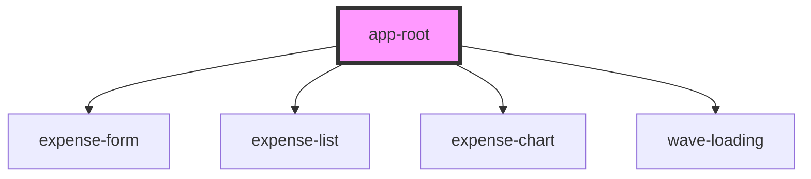

# app-root

<!-- Auto Generated Below -->

## Methods

### `toggleTheme() => Promise<void>`

#### Returns

Type: `Promise<void>`

## Dependencies

### Depends on

- [expense-form](../expense-form)
- [expense-list](../expense-list)
- [expense-chart](../expense-chart)
- [wave-loading](../wave-loading)

### Graph

----------------------------------------------

*Built with [StencilJS](https://stenciljs.com/)*
