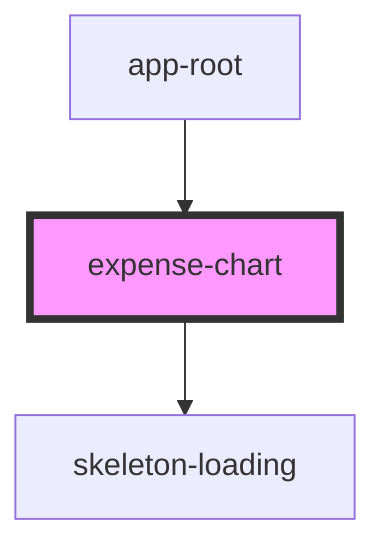

# expense-chart

<!-- Auto Generated Below -->

## Properties

| Property   | Attribute | Description | Type            | Default     |
| ---------- | --------- | ----------- | --------------- | ----------- |
| `expenses` | --        |             | `ExpenseData[]` | `undefined` |

## Dependencies

### Used by

- [app-root](../app-root)

### Depends on

- [skeleton-loading](../skeleton-laoding)

### Graph

---

_Built with [StencilJS](https://stenciljs.com/)_
