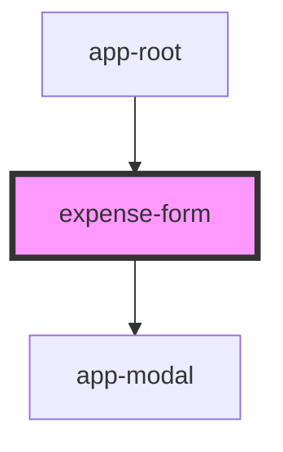

# expense-form

<!-- Auto Generated Below -->

## Properties

| Property   | Attribute   | Description | Type      | Default |
| ---------- | ----------- | ----------- | --------- | ------- |
| `showForm` | `show-form` |             | `boolean` | `false` |

## Dependencies

### Used by

 - [app-root](../app-root)

### Depends on

- [app-modal](../app-modal)

### Graph

----------------------------------------------

*Built with [StencilJS](https://stenciljs.com/)*
