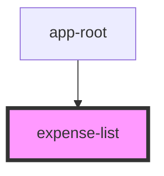

# expense-list

<!-- Auto Generated Below -->

## Properties

| Property   | Attribute | Description | Type            | Default     |
| ---------- | --------- | ----------- | --------------- | ----------- |
| `expenses` | --        |             | `ExpenseData[]` | `undefined` |

## Dependencies

### Used by

 - [app-root](../app-root)

### Graph

----------------------------------------------

*Built with [StencilJS](https://stenciljs.com/)*
